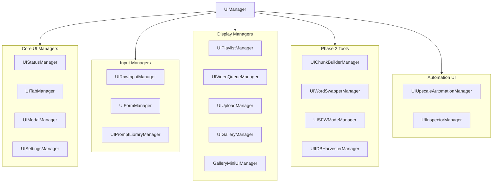

# GVP 21 Sub-Managers Hierarchy

## Summary
UIManager orchestrates 21 specialized sub-managers, each handling a specific UI subsystem. All sub-managers receive the shadowRoot reference and key dependencies in their constructor.

## Architecture Diagram



## File Locations

All sub-managers located in: `src/content/managers/ui/`

| Manager | File | Purpose |
|---------|------|---------|
| UIStatusManager | `UIStatusManager.js` | Real-time status badges |
| UITabManager | `UITabManager.js` | Tab navigation |
| UIModalManager | `UIModalManager.js` | Fullscreen overlays |
| UISettingsManager | `UISettingsManager.js` | Settings panel |
| UIRawInputManager | `UIRawInputManager.js` | RAW prompt input |
| UIFormManager | `UIFormManager.js` | JSON form builder |
| UIPromptLibraryManager | `UIPromptLibraryManager.js` | Folder-based prompt storage |
| UIPlaylistManager | `UIPlaylistManager.js` | History tab, video player |
| UIVideoQueueManager | `UIVideoQueueManager.js` | Queue grid display |
| UIUploadManager | `UIUploadManager.js` | Upload panel |
| UIGalleryManager | `UIGalleryManager.js` | Gallery card tracking |
| GalleryMiniUIManager | `GalleryMiniUIManager.js` | Mini-UI rails |
| UIChunkBuilderManager | `UIChunkBuilderManager.js` | Chunk Builder |
| UIWordSwapperManager | `UIWordSwapperManager.js` | Word Swapper |
| UISFWModeManager | `UISFWModeManager.js` | SFW mode toggle |
| UIIDBHarvesterManager | `UIIDBHarvesterManager.js` | IDB data harvester |
| UIUpscaleAutomationManager | `UIUpscaleAutomationManager.js` | Upscale automation |
| UIInspectorManager | `UIInspectorManager.js` | UUID inspector |

## Initialization Order

Defined in `UIManager._initializeSubManagers()`:

1. **UIStatusManager** - Status indicators first
2. **UITabManager** - Navigation structure
3. **UIModalManager** - Modal system
4. **GalleryMiniUIManager** - Before UIGalleryManager (dependency)
5. **UIGalleryManager** - Gallery tracking
6. **UIInspectorManager** - If InspectionManager exists
7. **UISettingsManager** - Settings panel
8. **UIRawInputManager** - RAW input
9. **UIFormManager** - JSON form
10. **UIPromptLibraryManager** - Prompt library
11. **Phase 2 managers** - Chunk, WordSwap, SFW, Harvester
12. **UIUploadManager** - If UploadAutomationManager exists
13. **UIPlaylistManager** - History display

## Cross-References

- **See KI: gvp-shadow-dom-isolation** - Where managers attach elements
- **See KI: gvp-manager-pattern-architecture** - How managers receive dependencies
- **See KI: gvp-toast-notification-system** - Toast system in UIManager

## Key Patterns

### Constructor Dependencies

Each manager receives what it needs:
```javascript
// Example: UIRawInputManager
new window.UIRawInputManager(
    stateManager,           // State access
    advancedRawInputManager,// Logic handler
    reactAutomation,        // UI automation
    shadowRoot,             // DOM attachment
    uiHelpers,              // Utility functions
    uiModalManager          // Modal access
)
```

### Destroy Method

Major managers implement `destroy()` for cleanup:
- Remove event listeners
- Clear timers
- Disconnect observers

This prevents memory leaks when the extension context is invalidated.

## Back-References

`UITabManager` receives `uiManager` reference to access other managers:
```javascript
this.uiTabManager.uiManager = this;
```

This allows tabs to trigger actions in other managers (e.g., switching tabs updates form data).
