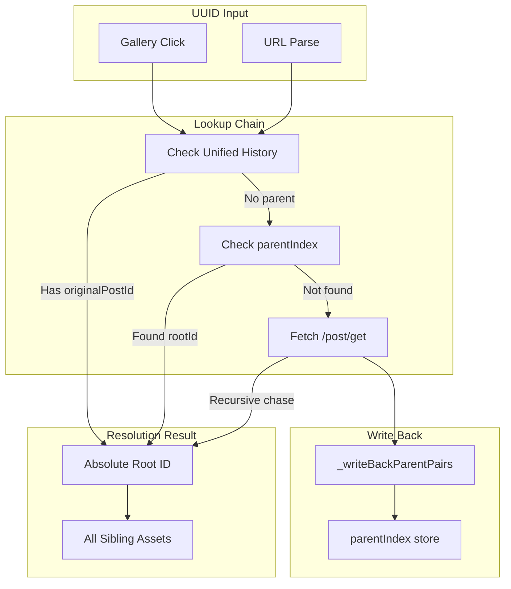

# GVP Absolute Root Lineage Resolution

## Summary
GVP tracks image/video lineage through parent-child relationships. The "Absolute Root" is the original image from which all edits and videos derive. Resolution uses a recursive chase algorithm with O(1) IndexedDB index fallback.

## Architecture Diagram



## File Locations

| Component | File Path |
|-----------|-----------|
| Resolution logic | `src/content/managers/ui/GalleryMiniUIManager.js` - `_getAbsoluteRootId()` |
| Parent index | `src/content/managers/IndexedDBManager.js` - `parentIndex` store |
| API fetch | `src/content/managers/NetworkInterceptor.js` - `fetchPostDetails()` |

## Lineage Data Model

```
Root Image (originalPostId: null)
├── Edit 1 (parentId: root)
│   ├── Video 1a (parentId: edit1)
│   └── Video 1b (parentId: edit1)
├── Edit 2 (parentId: root)
│   └── Video 2a (parentId: edit2)
└── Video 0 (parentId: root, direct)
```

Every asset has:
- `parentId`: Direct parent UUID
- `rootImageId`: Absolute root UUID (sometimes missing)
- `originalPostId`: Alternative root reference

## Resolution Strategies

### Strategy 1: UVH Check
Check `unifiedHistory` entry for `originalPostId` field.

### Strategy 2: parentIndex Lookup
Call `idb.resolveRoot(childId)` for O(1) lookup:
```javascript
const record = await parentIndex.get(childId);
return record?.rootId ?? null;
```

### Strategy 3: API Recursive Chase
If local data incomplete:
1. Fetch `/rest/media/post/get?postId={currentId}`
2. Extract `parentId` from response
3. If `parentId` exists, recurse on parent
4. Continue until no parent (that's the root)
5. Write back all discovered relationships

## Write Back Pattern

After successful API resolution, `_writeBackParentPairs()` writes:
```
{ childId: edit1, rootId: rootId }
{ childId: video1a, rootId: rootId }
{ childId: video1b, rootId: rootId }
```

This transforms O(N) recursive chase into O(1) for every family member.

## Cross-References

- **See KI: gvp-indexeddb-schema-v19** - parentIndex store definition
- **See KI: gvp-gallery-mini-ui-rails** - How lineage feeds the UI
- **See KI: gvp-unified-video-history-flow** - Source of originalPostId

## Key Methods

| Method | Location | Description |
|--------|----------|-------------|
| `_getAbsoluteRootId(imageId)` | GalleryMiniUIManager | Main resolution entry point |
| `resolveRoot(childId)` | IndexedDBManager | O(1) index lookup |
| `setParentLinks(pairs)` | IndexedDBManager | Batch write lineage |
| `fetchPostDetails(postId)` | NetworkInterceptor | API fetch for lineage |

## Lineage Token Pattern

GalleryMiniUIManager stores `this._currentAbsoluteRootId` during UI open. This allows O(1) relevance checking during sync events without re-resolving.

## Reverse Scan Strategy

For UUID extraction from URLs:
1. Split path by `/`
2. Iterate in REVERSE order
3. Return first 36-char UUID match

This ensures Asset ID is captured, not Account ID (which comes earlier in URL).

## Sibling Discovery

Once root is resolved:
1. Call `fetchPostDetails(rootId)`
2. Extract `images[]` array (all edits)
3. Extract `videos[]` array (all videos)
4. Combine for complete sibling set
