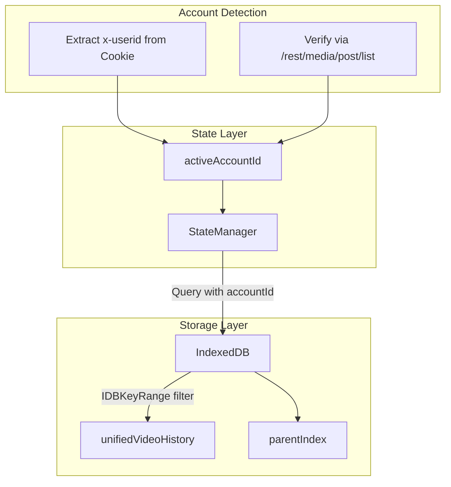

# GVP Account Isolation Architecture

## Summary
All GVP data is partitioned by Grok Account UUID. StateManager tracks `activeAccountId` and all IndexedDB queries use account-scoped indexes to prevent data leakage between accounts.

## Architecture Diagram



## File Locations

| Component | File Path |
|-----------|-----------|
| Account tracking | `src/content/managers/StateManager.js` - `activeAccountId` property |
| Cookie extraction | `src/content/managers/NetworkInterceptor.js` - `_extractUserIdFromCookie()` |
| IndexedDB queries | `src/content/managers/IndexedDBManager.js` - All getAll methods |

## Account Switch Protocol

1. **Detection**: NetworkInterceptor monitors `x-userid` header in responses
2. **Verification**: Compares against `multiGenHistory.activeAccountId`
3. **Mismatch Action**: Calls `StateManager.setActiveAccount(newId)`
4. **Data Clear**: Clears in-memory state for old account
5. **Hydration**: Loads data from IndexedDB for new account
6. **Sync Trigger**: Fires `triggerBulkGallerySync` if account hasn't been synced

## Account Switch Flow

The `setActiveAccount(newId)` method in StateManager:

1. Validates new ID format
2. Clears timeouts for old account attempts
3. Updates `activeAccountId` in state
4. Persists to `chrome.storage.local` under `gvp-active-account` key
5. Filters `multiGenHistory.images` to only include entries matching new account
6. Clears `galleryData` and `unifiedHistory` arrays
7. Triggers async load from IndexedDB for new account

## IndexedDB Account Scoping

All queries use `IDBKeyRange` bound to the account ID:

```
Index: accountId
Query: IDBKeyRange.only(accountId)
```

This is implemented in:
- `getAllUnifiedEntries(accountId, limit)` 
- `getMultiGenHistory()` - filters by active account

## Startup Identity Check

On initialization, StateManager calls `performStartupAccountCheck()`:

1. Extract `x-userid` from `document.cookie`
2. If mismatch with stored ID, trigger verification pulse
3. Verification: Call `/rest/media/post/list` with limit 10
4. Confirm identity from response
5. If new account, run full sync

## Cross-References

- **See KI: gvp-manager-pattern-architecture** - StateManager's role
- **See KI: gvp-indexeddb-schema-v19** - accountId indexes
- **See KI: gvp-unified-video-history-flow** - Account-scoped history

## Key Methods

| Method | Location | Description |
|--------|----------|-------------|
| `setActiveAccount(id)` | StateManager | Switch active account, clear old data |
| `getActiveMultiGenAccount()` | StateManager | Get current active account ID |
| `loadAccountSyncStatus(id)` | StateManager | Check if gallery synced for account |

## Explicit Context Pattern

When passing accountId through async operations, capture the ID at the entry point and pass it explicitly through all functions. Do NOT rely on global state inside async callbacks as the account may have switched during the operation.

Example in `triggerBulkGallerySync`:
1. Capture `accountId` at start
2. Pass to `_normalizeGalleryPost`
3. Pass to `_ingestListToUnified`

This prevents "poisoned" records with wrong account stamps.
