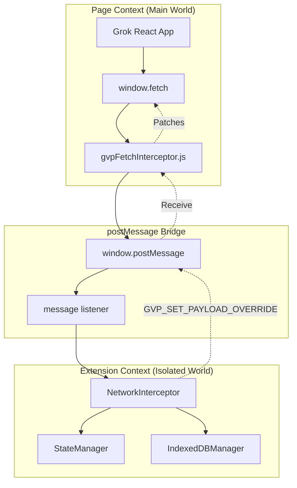

# GVP Dual-Layer Fetch Interception

## Summary
GVP intercepts network requests in two contexts: content script (NetworkInterceptor) for orchestration, and injected page script (gvpFetchInterceptor) for direct window.fetch access. Communication via postMessage bridge.

## Architecture Diagram



## File Locations

| Component | File Path |
|-----------|-----------|
| Content script interceptor | `src/content/managers/NetworkInterceptor.js` |
| Page context interceptor | `public/injected/gvpFetchInterceptor.js` |
| Injection manifest | `manifest.json` - `web_accessible_resources` |

## Why Two Layers?

| Context | Limitation | Solution |
|---------|------------|----------|
| Content Script | Cannot access `window.fetch` directly | Inject page script |
| Page Script | Cannot access extension APIs | postMessage bridge |

The page script patches `window.fetch` before Grok loads. The content script orchestrates logic and persists data.

## Message Types

### Content → Page
| Type | Purpose |
|------|---------|
| `GVP_SET_PAYLOAD_OVERRIDE` | Arm payload injection for next request |
| `GVP_SET_EXPECTATION` | Set expected generation type for guard |
| `GVP_CLEAR_OVERRIDE` | Clear pending override |

### Page → Content
| Type | Purpose |
|------|---------|
| `GVP_FETCH_RESPONSE` | Response data for processing |
| `GVP_STREAM_CHUNK` | SSE chunk data |

## Injection Method

Page script injected via manifest:
```json
"web_accessible_resources": [{
    "resources": ["public/injected/gvpFetchInterceptor.js"],
    "matches": ["*://grok.com/*"]
}]
```

Content script creates script element to run it in page context.

## Fetch Wrapper Pattern

In `gvpFetchInterceptor.js`:
1. Save original `window.fetch` as `originalFetch`
2. Replace with wrapper function
3. Wrapper checks URL for GVP-interesting endpoints
4. Clone response for processing
5. Return original response to caller

## Cross-References

- **See KI: gvp-sse-ndjson-stream-decoding** - How stream chunks are processed
- **See KI: gvp-network-guard-gatekeeper** - Intent blocking in page context
- **See KI: gvp-unified-video-history-flow** - Data destination

## Key Methods

| Method | Location | Description |
|--------|----------|-------------|
| `_overrideFetch()` | NetworkInterceptor | Set up content script listener |
| `fetchWrapper()` | gvpFetchInterceptor | Page context fetch patch |
| `_processResponseBody()` | NetworkInterceptor | Stream decoding |

## Endpoints Intercepted

| Endpoint | Purpose |
|----------|---------|
| `/rest/app-chat/conversations/new` | Generation submission |
| `/rest/media/post/list` | Gallery sync |
| `/rest/media/post/get` | Post details |
| `/rest/media/creation/new` | SSE stream for progress |

## AbortSignal Propagation

The wrapper must propagate `AbortSignal` to prevent zombie requests:
1. Extract `signal` from options
2. Pass to `originalFetch` call
3. If aborted, wrapper's processing stops cleanly

## Response Cloning

Response body can only be read once. The wrapper:
1. Clones response: `response.clone()`
2. Processes clone in background
3. Returns original to caller
