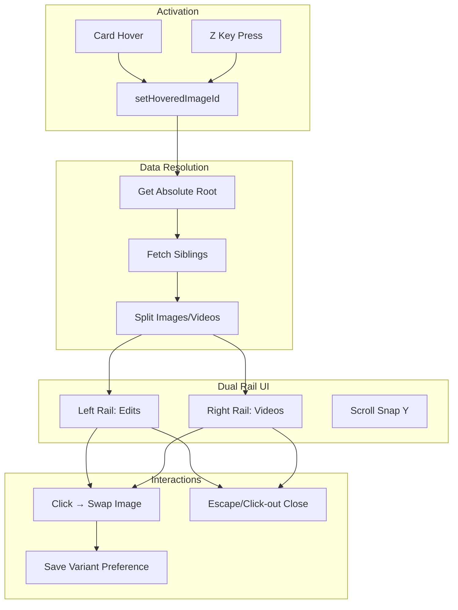

# GVP Gallery Mini-UI Rails

## Summary
The Mini-UI provides a dual-rail overlay for exploring image edit variants (left rail) and generated videos (right rail). Activated by 'Z' key + hover, it uses glassmorphism styling and instant image swapping.

## Architecture Diagram



## File Locations

| Component | File Path |
|-----------|-----------|
| Mini-UI manager | `src/content/managers/ui/GalleryMiniUIManager.js` |
| Gallery hover tracking | `src/content/managers/ui/UIGalleryManager.js` |
| Z-key handler | `src/content/content.js` - keydown listener |

## UI Structure

```
#gvp-gallery-rails (fixed position overlay)
├── .gvp-rail-container
│   ├── .gvp-rail.left (Image Edits)
│   │   └── .gvp-rail-item × N
│   └── .gvp-rail.right (Generated Videos)
│       └── .gvp-rail-item × N
```

## Glassmorphism Styling

```css
background: rgba(20, 20, 20, 0.72);
backdrop-filter: blur(12px);
border-radius: 12px;
```

## Activation Flow

1. User hovers gallery card → `UIGalleryManager` sets `hoveredImageId`
2. User presses 'Z' → Keydown handler checks:
   - Is hover active?
   - Is NOT typing context? (input, textarea, contenteditable)
3. If valid → Open Mini-UI for `hoveredImageId`

## Typing Context Protection

The 'Z' key is blocked if:
- `document.activeElement` is input/textarea/select
- `activeElement.isContentEditable` is true
- Focus is inside TipTap editor

**Exception**: If user is hovering a card, hover intent takes priority over sticky focus.

## Cross-References

- **See KI: gvp-absolute-root-lineage-resolution** - How root is resolved
- **See KI: gvp-shadow-dom-isolation** - Where rails are rendered
- **See KI: gvp-multi-tab-synchronization** - Cross-tab variant sync

## Key Methods

| Method | Description |
|--------|-------------|
| `_resolveData(imageId)` | Fetch lineage and populate rails |
| `_makeThumbBtn(item, railType)` | Create thumbnail button |
| `_handleThumbClick(item)` | Swap main image, save preference |
| `close()` | Remove UI, clear state |

## Image Swap Flow

1. User clicks thumbnail in rail
2. Get `item.url` from clicked button
3. Find main gallery card `img` or `video` element
4. Swap `src` attribute
5. Clear `srcset` to force new image
6. Call `StateManager.savePersistentVariantSelection(rootId, variantId)`

## Variant Persistence

Selections persist across sessions via IndexedDB:
- Store: `unifiedVideoHistory`
- Field: `selectedVariantId`
- Key: `rootImageId`

On page refresh, `UIGalleryManager` auto-restores the last selection.

## Root Visualization

- Root images sorted to front of left rail
- Marked with "⭐ Original" pill badge
- If root is a video, synthesize thumb from `<video poster>`

## Error Handling

- 403/404 thumbnails → Replace with SVG placeholder (Photo or Play icon)
- Missing lineage data → Show "No variants" message
- Resolution timeout → Close UI with toast

## Event Cleanup

On close:
- Remove rail DOM elements
- Clear `_currentAbsoluteRootId`
- Remove document click listener
- Dispatch `gvp:mini-ui-closed` for other managers
