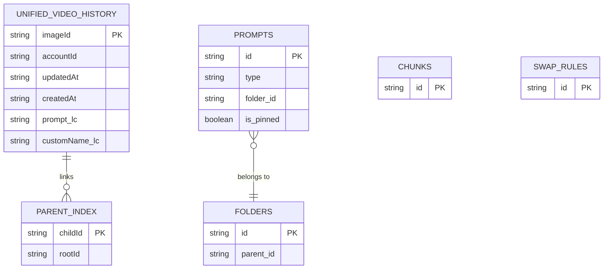

# GVP IndexedDB Schema v19

## Summary
GVP uses IndexedDB for unlimited persistent storage with 19 object stores. The database name is `GrokVideoPrompter` at version 19, featuring declarative migrations and lowercase search indexes.

## Architecture Diagram

## File Location

- **Primary**: `src/content/managers/IndexedDBManager.js`
- **Store constants**: Lines 23-48 define `STORES` object

## Object Store Registry

| Store Name | Key Path | Purpose |
|------------|----------|---------|
| `unifiedVideoHistory` | `imageId` | All generation history with videos array |
| `parentIndex` | `childId` | O(1) parent UUID resolution |
| `prompts` | `id` | Prompt library entries |
| `promptVersions` | `id` | Version history for prompts |
| `folders` | `id` | Prompt library folders |
| `promptTags` | `id` | Tags for prompts |
| `usageLog` | `id` | Prompt usage tracking |
| `recents` | `id` | Recently used items |
| `chunks` | `id` | Chunk Builder segments |
| `swap_rules` | `id` | Word Swapper rules |
| `jsonPresets` | `name` | Saved JSON configurations |
| `rawTemplates` | `id` | RAW prompt templates |

## Migration System

Migrations are defined in `IndexedDBManager.MIGRATIONS` static object. Each version number maps to a function that receives `(db, transaction, STORES)`.

### Key Migrations

| Version | Change |
|---------|--------|
| v1 | Initial stores: multiGenHistory, progressTracking |
| v4 | Unified video history, saved prompt slots |
| v13 | Prompt library: prompts, folders, tags |
| v17 | parentIndex for lineage resolution |
| v19 | Lowercase search indexes (prompt_lc, customName_lc) |

## Important Indexes

### Unified Video History Store
- `accountId` - Filter by account
- `updatedAt` - Sort by recency
- `prompt_lc` - Case-insensitive prompt search
- `customName_lc` - Case-insensitive name search

### Parent Index Store
- `rootId` - Find all children of a root

## Cross-References

- **See KI: gvp-manager-pattern-architecture** - How IndexedDBManager is initialized
- **See KI: gvp-account-isolation-architecture** - Account partitioning strategy
- **See KI: gvp-multi-tab-synchronization** - BroadcastChannel sync mechanism

## Key Methods

| Method | Description |
|--------|-------------|
| `initialize()` | Opens database, runs migrations, sets up handlers |
| `saveUnifiedEntries(entries)` | Batch save to unified history |
| `getAllUnifiedEntries(accountId, limit)` | Retrieve entries for account |
| `setParentLink(childId, rootId)` | Write lineage link |
| `resolveRoot(childId)` | O(1) root UUID lookup |

## Storage Limits

Defined in `IndexedDBManager.LIMITS`:
- `MAX_GALLERY_POSTS`: 100,000
- `MAX_IMAGE_PROJECT_AGE_DAYS`: 90

## Late Initialization Pattern

If IndexedDB initialization times out (15s), the system continues with chrome.storage fallback. When IDB finally connects, it dispatches `gvp:idb-late-init` event for managers to refresh their data.
