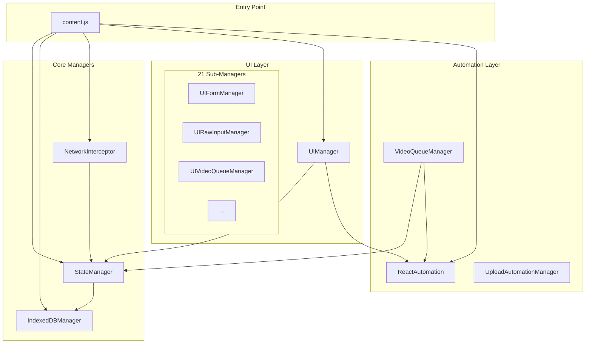

# GVP Manager Pattern Architecture

## Summary
GVP uses a centralized Manager Pattern where StateManager is the single source of truth for all application state. All managers depend on StateManager for state access and persistence.

## Architecture Diagram

## File Locations

| Manager | File Path |
|---------|-----------|
| StateManager | `src/content/managers/StateManager.js` |
| IndexedDBManager | `src/content/managers/IndexedDBManager.js` |
| NetworkInterceptor | `src/content/managers/NetworkInterceptor.js` |
| UIManager | `src/content/managers/UIManager.js` |
| ReactAutomation | `src/content/managers/ReactAutomation.js` |
| VideoQueueManager | `src/content/managers/VideoQueueManager.js` |
| UploadAutomationManager | `src/content/managers/UploadAutomationManager.js` |

## Dependency Rules

1. **StateManager is always first** - All managers receive StateManager in constructor
2. **No circular dependencies** - Managers only depend on managers created before them
3. **Single source of truth** - No manager writes to storage directly; all go through StateManager

## Manager Initialization Order

The initialization sequence in `content.js` follows this order:

1. IndexedDBManager (no dependencies)
2. StateManager (receives IndexedDBManager)
3. StorageManager (receives IndexedDBManager)
4. NetworkInterceptor (receives StateManager, IndexedDBManager)
5. ReactAutomation (receives StateManager)
6. UIManager (receives all above managers)

## Cross-References

- **See KI: gvp-indexeddb-schema-v19** - Storage layer used by StateManager
- **See KI: gvp-account-isolation-architecture** - How StateManager partitions data by account
- **See KI: gvp-21-sub-managers-hierarchy** - UI sub-manager organization

## Key Methods

| Method | Location | Description |
|--------|----------|-------------|
| `updateState()` | StateManager | Merges partial state and dispatches `gvp:state-updated` event |
| `getState()` | StateManager | Returns current state object |
| `initialize()` | All Managers | Async setup, returns Promise<boolean> |

## State Sovereignty Principle

All persistent extension state MUST be managed via StateManager. No individual manager should write directly to `chrome.storage` or IndexedDB for shared state. This ensures:

- Consistent state across managers
- Single point for account isolation
- Unified event dispatching
