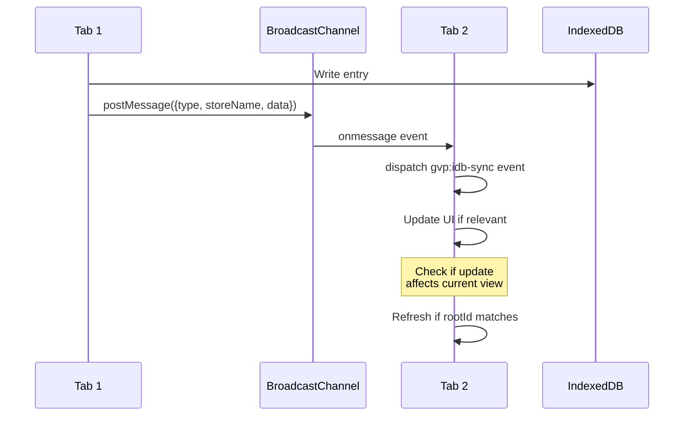

# GVP Multi-Tab Synchronization

## Summary
GVP uses BroadcastChannel API to keep state consistent across browser tabs. When one tab writes to IndexedDB, it broadcasts the change and other tabs update their UI accordingly.

## Architecture Diagram



## File Locations

| Component | File Path |
|-----------|-----------|
| Channel setup | `src/content/managers/IndexedDBManager.js` - constructor |
| Broadcast trigger | `src/content/managers/IndexedDBManager.js` - `_broadcastChange()` |
| Event listener | `src/content/managers/ui/UIGalleryManager.js` |
| Mini-UI sync | `src/content/managers/ui/GalleryMiniUIManager.js` |

## Channel Name

```
BroadcastChannel: 'gvp_db_sync'
```

## Message Format

```javascript
{
    type: 'write' | 'delete' | 'clear',
    storeName: 'unifiedVideoHistory' | 'parentIndex' | ...,
    data: { imageId, ... } // optional
}
```

## Event Flow

1. **Write happens**: IndexedDBManager saves data
2. **Broadcast**: `_broadcastChange(type, storeName, data)` called
3. **Receive**: Other tabs receive via `syncChannel.onmessage`
4. **Dispatch**: `window.dispatchEvent(new CustomEvent('gvp:idb-sync', {detail}))`
5. **UI Update**: Managers listen for `gvp:idb-sync` and check relevance

## Relevance Checking

When a tab receives a sync event, it checks:

1. Is the `storeName` relevant to current view?
2. Does the `imageId` match current selection?
3. Does the `rootId` match the open Mini-UI?

If relevant, the manager refreshes its data. This prevents jittery UI from unrelated background updates.

## Cross-References

- **See KI: gvp-indexeddb-schema-v19** - Stores being synced
- **See KI: gvp-gallery-mini-ui-rails** - Mini-UI sync handling
- **See KI: gvp-unified-video-history-flow** - Data being synchronized

## Key Methods

| Method | Location | Description |
|--------|----------|-------------|
| `_broadcastChange(type, storeName, data)` | IndexedDBManager | Send change to other tabs |
| `_setupSyncListener()` | IndexedDBManager | Set up BroadcastChannel listener |

## View Identity Guard

To prevent state leakage during rapid image switching, managers capture identity markers before async operations:

- `capturedRootId`
- `capturedImageId` 
- `capturedRootEl`

After the async fetch, all three must match the active UI state for the refresh to proceed.

## Custom Events

Standard GVP custom events for cross-component communication:
- `gvp:idb-sync` - Cross-tab database changes
- `gvp:state-updated` - State mutations
- `gvp:unified-history-updated` - History changes
- `gvp:vidgen-beacon` - Generation progress
