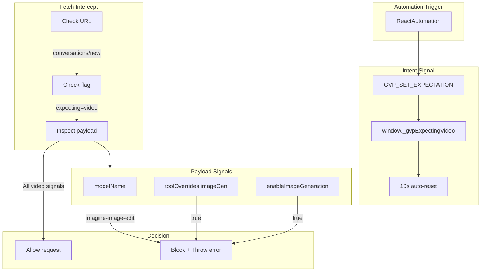

# GVP Network Guard Gatekeeper

## Summary
The Network Guard is the final defense layer that blocks accidental Image Edit requests when GVP expects a Video Generation. It operates in the page context via gvpFetchInterceptor.js.

## Architecture Diagram



## File Locations

| Component | File Path |
|-----------|-----------|
| Intent signaling | `src/content/managers/ReactAutomation.js` - fallback path |
| Guard implementation | `public/injected/gvpFetchInterceptor.js` - `fetchWrapper()` |
| Error handling | `src/content/managers/NetworkInterceptor.js` |

## Arming the Guard

Before submission in fallback path (Settings → Make Video menu):

```javascript
window.postMessage({
    source: 'gvp-extension',
    type: 'GVP_SET_EXPECTATION',
    payload: { expect: 'video' }
}, '*');
```

This sets `window._gvpExpectingVideo = true` with a 10-second auto-reset.

## Payload Signals for Image Edit

| Field | Value | Meaning |
|-------|-------|---------|
| `modelName` | `"imagine-image-edit"` | Image edit model |
| `toolOverrides.imageGen` | `true` | Image generation enabled |
| `enableImageGeneration` | `true` | Image gen flag |

If ANY of these are present when expecting video, the request is BLOCKED.

## Block Behavior

When blocked:
1. Throw `Error: 🛑 GVP NETWORK GUARD: BLOCKED ACCIDENTAL IMAGE EDIT`
2. Log full error to console
3. Reset `window._gvpExpectingVideo = false`
4. Extension UI shows error toast

## Cross-References

- **See KI: gvp-triple-layer-defense** - Full defense architecture
- **See KI: gvp-dual-layer-fetch-interception** - Where guard lives
- **See KI: gvp-tiptap-prosemirror-injection** - Where arming happens

## Key Methods

| Method | Location | Description |
|--------|----------|-------------|
| `sendToGenerator()` | ReactAutomation | Arming in fallback path |
| `fetchWrapper()` | gvpFetchInterceptor | Guard implementation |
| `_checkImageEditSignals(payload)` | gvpFetchInterceptor | Signal detection |

## Defense Gap (Known Issue)

The **primary path** (direct button click) does NOT arm the guard. It relies only on DOM-level button detection. 

**Recommendation**: Arm the guard at the START of `sendToGenerator()` for both paths.

## Timeout Safety

10-second timeout ensures the flag doesn't persist forever:
```javascript
setTimeout(() => {
    window._gvpExpectingVideo = false;
}, 10000);
```

This prevents permanent blocking if automation fails mid-process.

## Payload Inspection Location

The inspection happens in `fetchWrapper()` before the request is sent:
1. Clone request body
2. Parse as JSON
3. Check for image edit signals
4. Block or allow
5. Return cloned body to request
