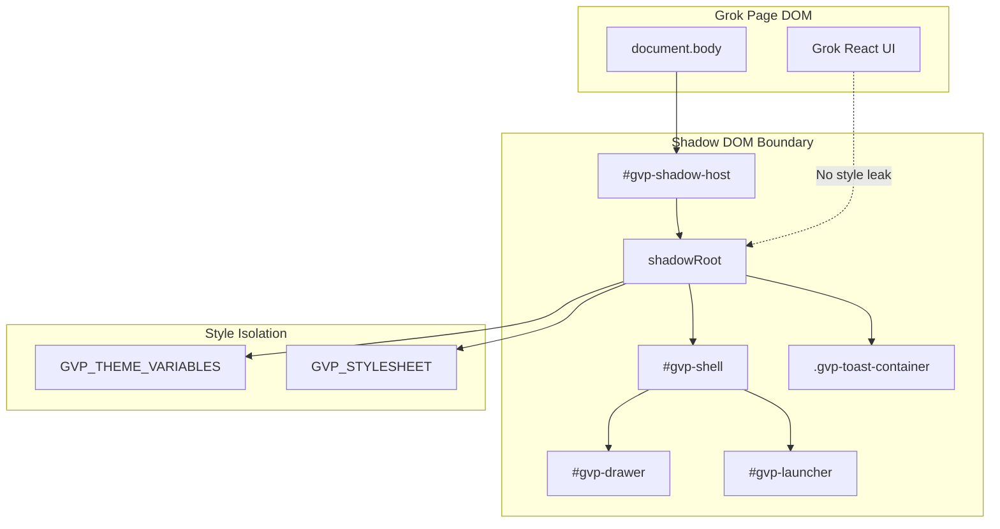

# GVP Shadow DOM Isolation Pattern

## Summary
GVP renders all UI inside a Shadow DOM attached to `#gvp-shadow-host`. This isolates extension styles from Grok's CSS and prevents Grok's React event listeners from interfering with extension inputs.

## Architecture Diagram



## File Locations

| Component | File Path |
|-----------|-----------|
| Shadow host creation | `src/content/managers/UIManager.js` - `_createShadowDOM()` |
| Styles injection | `src/content/constants/stylesheet.js` - `GVP_STYLESHEET` |
| Theme variables | `src/content/constants/theme.js` - `GVP_THEME_VARIABLES` |

## Creation Sequence

1. Create `div#gvp-shadow-host` attached to `document.body`
2. Attach Shadow Root with `{ mode: 'open', delegatesFocus: false }`
3. Create `<style>` element with theme + stylesheet
4. Append style to shadowRoot
5. Initialize sub-managers (they append to shadowRoot)

## Style Injection

```javascript
// In _createShadowDOM()
const style = document.createElement('style');
style.textContent = themeStyles + GVP_STYLESHEET;
this.shadowRoot.appendChild(style);
```

All styles in `stylesheet.js` are scoped to `#gvp-shadow-host`.

## Focus Management

The shadow host prevents external focus capture:

```javascript
// Prevent external focus theft
shadowHost.addEventListener('focusin', (e) => {
    e.stopPropagation(); // Allow focus within shadow DOM
}, { capture: true });

shadowHost.addEventListener('focusout', (e) => {
    if (relatedTarget && !shadowRoot.contains(relatedTarget)) {
        e.stopPropagation(); // Block external focus grab
    }
}, { capture: true });
```

## Cross-References

- **See KI: gvp-21-sub-managers-hierarchy** - Managers that append to shadowRoot
- **See KI: gvp-toast-notification-system** - Toasts rendered in shadowRoot
- **See KI: gvp-tiptap-prosemirror-injection** - How GVP interacts with Grok's TipTap (outside shadow)

## Key Methods

| Method | Description |
|--------|-------------|
| `_createShadowDOM()` | Create host, attach shadow, inject styles |
| `_createBackdrop()` | Create modal backdrop in shadowRoot |
| `_initializeSubManagers()` | Pass shadowRoot to all UI managers |

## Modal/Dialog Placement

All overlays must attach to `shadowRoot`, NOT `document.body`:
- Dialogs (`showConfirm`, `showPrompt`)
- Modals (fullscreen editor, import modal)
- Toast notifications

This ensures they inherit extension styles and stay isolated from Grok's UI.

## Shadow Root Access

Sub-managers receive `shadowRoot` reference in constructor:
```javascript
this.uiStatusManager = new window.UIStatusManager(this.stateManager, this.shadowRoot);
```

They append elements directly to `this.shadowRoot` for proper isolation.
