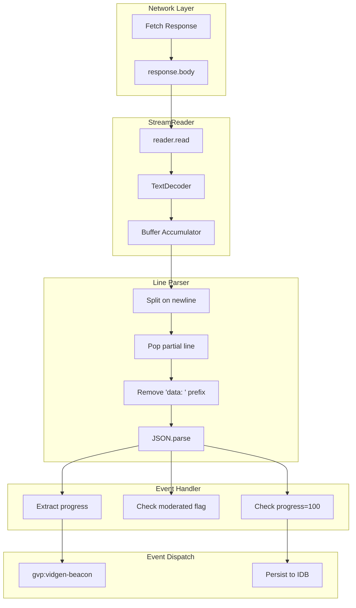

# GVP SSE/NDJSON Stream Decoding

## Summary
Grok's video generation uses Server-Sent Events (SSE) with Newline-Delimited JSON (NDJSON). GVP intercepts these streams, decodes fragmented chunks, and extracts progress/moderation signals.

## Architecture Diagram



## File Locations

| Component | File Path |
|-----------|-----------|
| Stream processing | `src/content/managers/NetworkInterceptor.js` - `_processStream()` |
| Line parsing | `src/content/managers/NetworkInterceptor.js` - `_processLine()` |
| Event dispatch | `src/content/managers/NetworkInterceptor.js` - `_dispatchVidGenBeacon()` |

## NDJSON Format

Each line is either:
- SSE format: `data: {"key": "value"}\n`
- Raw JSON: `{"key": "value"}\n`

The parser handles both formats.

## Buffer-Aware Parsing

Chunks may arrive fragmented:
- Partial line at end of chunk
- Multiple lines in single chunk

Algorithm:
1. Append chunk to buffer
2. Split buffer on `\n`
3. Pop last element (may be partial)
4. Process complete lines
5. Keep partial in buffer for next chunk

## Progress Extraction

From decoded JSON:
| Field | Purpose |
|-------|---------|
| `generatorProgress` | Percentage 0-100 |
| `moderated` | Boolean for content flag |
| `reasonForBlocking` | Moderation reason text |
| `videoUrl` | Completed video URL |
| `videoId` | Video UUID |

## Cross-References

- **See KI: gvp-dual-layer-fetch-interception** - How streams are intercepted
- **See KI: gvp-terminal-state-persistence** - When progress triggers save
- **See KI: gvp-video-queue-pipeline** - How queue tracks progress

## Key Methods

| Method | Description |
|--------|-------------|
| `_processStream(response, context)` | Main stream reading loop |
| `_processLine(line)` | Parse single NDJSON line |
| `_dispatchVidGenBeacon(data)` | Emit progress event |

## Beacon Payload

```javascript
{
    videoId: string,
    imageId: string,
    progress: number,
    moderated: boolean,
    videoUrl: string,
    thumbnailUrl: string,
    moderationReason: string
}
```

## Terminal Detection

| Condition | Action |
|-----------|--------|
| `progress === 100 && !moderated` | Success - persist to IDB |
| `moderated === true` | Moderated - persist with flag |
| Stream ends before 100 | Error - log, no persist |

## Error Handling

- JSON parse errors: Log warning, continue processing
- Stream errors: Dispatch error event, clean up
- Empty chunks: Skip silently

## Real-Time Updates

`gvp:vidgen-beacon` events fire for every progress chunk. UI components subscribe to show real-time progress bars without disk I/O.
