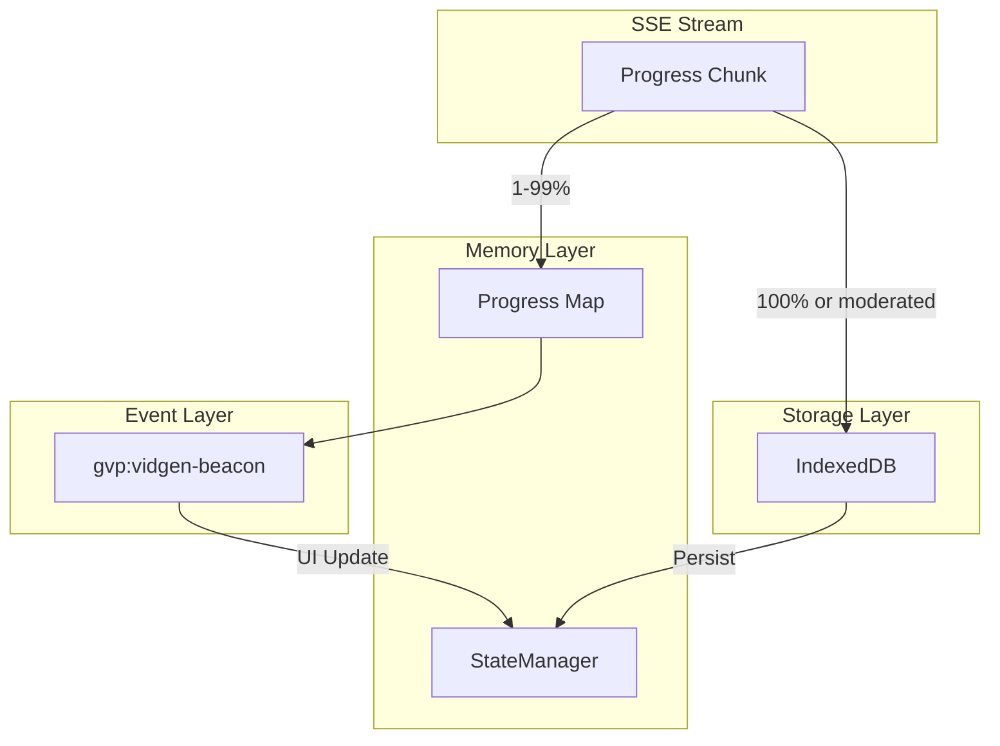

# GVP Terminal-State-Only Persistence Pattern

## Summary
To prevent disk I/O bottlenecks during bulk operations, GVP only writes to IndexedDB when progress reaches a terminal state (100% complete or moderated). Intermediate progress is kept in memory and broadcast via events.

## Architecture Diagram



## File Locations

| Component | File Path |
|-----------|-----------|
| Progress tracking | `src/content/managers/StateManager.js` - `generation.progressTracking` Map |
| Stream decoding | `src/content/managers/NetworkInterceptor.js` - `_processStream()` |
| Persistence trigger | `src/content/managers/NetworkInterceptor.js` - `_processPayloadEvents()` |

## Terminal States

| State | Condition | Action |
|-------|-----------|--------|
| **Progress** | `progress >= 1 && progress <= 99` | Update memory only, broadcast beacon |
| **Success** | `progress === 100 && moderated === false` | Write to IndexedDB |
| **Moderated** | `moderated === true` | Write to IndexedDB with moderated flag |
| **Error** | Stream ends before 100% | Log error, no persistence |

## Memory-First Strategy

Progress updates follow this path:

1. **Receive chunk** from SSE stream
2. **Update memory**: `StateManager.state.generation.progressTracking.set(key, {progress, context, timestamp})`
3. **Broadcast**: `gvp:vidgen-beacon` event with progress data
4. **UI updates**: Rail components listen to beacon, show real-time progress
5. **Terminal reached**: Write full entry to IndexedDB

## Benefits

1. **Performance**: No disk writes during 1-99% progress
2. **Accuracy**: Final state captured, not intermediate states
3. **Reactivity**: UI stays responsive via event broadcasts
4. **Consistency**: Single write point prevents partial data

## Cross-References

- **See KI: gvp-sse-ndjson-stream-decoding** - How progress chunks are extracted
- **See KI: gvp-unified-video-history-flow** - Where terminal data is written
- **See KI: gvp-video-queue-pipeline** - How queue tracks terminal states

## Key Methods

| Method | Location | Description |
|--------|----------|-------------|
| `_processStream()` | NetworkInterceptor | Decode chunks, track progress |
| `_processPayloadEvents()` | NetworkInterceptor | Check terminal, trigger persistence |
| `upsertMultiGenEntry()` | IndexedDBManager | Actual write operation |

## Progress Beacon Payload

```javascript
{
    videoId: string,
    imageId: string,
    progress: number,
    moderated: boolean,
    videoUrl: string,
    thumbnailUrl: string
}
```

## Queue Integration

VideoQueueManager listens for `gvp:vidgen-beacon` to:
- Update queue item status when progress === 100
- Mark as moderated if moderated === true
- Schedule next item when terminal state reached
