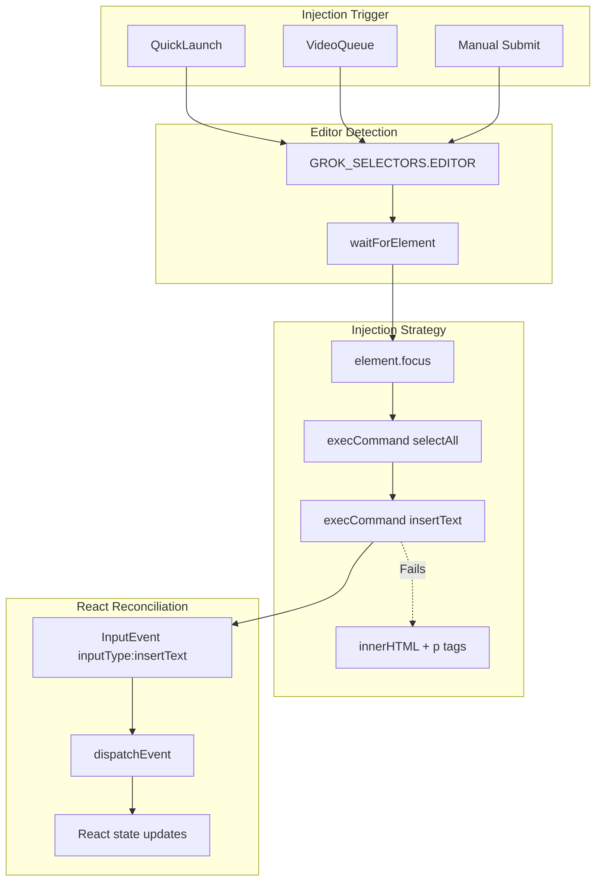

# GVP TipTap/ProseMirror Injection

## Summary
Grok uses TipTap/ProseMirror for rich text editing. Standard `.value` assignment fails because these are `contenteditable` divs, not textareas. GVP uses `execCommand('insertText')` for transaction-aware injection that React recognizes.

## Architecture Diagram



## File Locations

| Component | File Path |
|-----------|-----------|
| Injection method | `src/content/managers/ReactAutomation.js` - `_setEditableValue()` |
| Selectors | `src/content/constants/selectors.js` - `GROK_SELECTORS.EDITOR` |
| Form manager integration | `src/content/managers/ui/UIFormManager.js` - `handleGenerateJson()` |

## Editor Selectors

The TipTap/ProseMirror editor is identified by:
```
div[contenteditable="true"][translate="no"].ProseMirror
```

Multiple fallback selectors exist in `GROK_SELECTORS.EDITOR` array for different Grok UI states.

## Injection Protocol

### Primary Strategy: execCommand

1. **Focus**: `element.focus()` - Required for ProseMirror listeners
2. **Select All**: `document.execCommand('selectAll', false, null)` - Clear existing
3. **Insert**: `document.execCommand('insertText', false, text)` - Transaction-aware
4. **Fallback**: If execCommand fails, use innerHTML with `<p>` wrapping

### Why execCommand Works

- ProseMirror monitors `execCommand` for undo/redo stack
- Direct `innerHTML` clears transaction history
- `insertText` fires proper `InputEvent` that React recognizes

## Cross-References

- **See KI: gvp-video-queue-pipeline** - Batch injection via this method
- **See KI: gvp-dual-layer-fetch-interception** - Network-level prompt override
- **See KI: gvp-triple-layer-defense** - Safety checks before injection

## Key Methods

| Method | Location | Description |
|--------|----------|-------------|
| `_setEditableValue(element, text)` | ReactAutomation | Unified setter for textarea and contenteditable |
| `sendToGenerator(prompt, isRaw)` | ReactAutomation | Full flow: find editor, inject, submit |
| `waitForElement(selector, timeout)` | ReactAutomation | Poll for editor mount |

## Line Handling

TipTap requires text wrapped in `<p>` tags for line breaks:
- Each line becomes `<p>line content</p>`
- Empty lines become `<p><br></p>`

This is only used in the `innerHTML` fallback path.

## Legacy Textarea Support

For backward compatibility, `_setEditableValue` also handles traditional textareas:
1. Use `Object.getOwnPropertyDescriptor` to get native value setter
2. Call native setter directly (bypasses React synthetic events)
3. Dispatch `change` and `input` events

## Event Dispatch

After injection, dispatch:
```javascript
element.dispatchEvent(new InputEvent('input', {
    bubbles: true,
    data: text,
    inputType: 'insertText'
}));
```

The `inputType: 'insertText'` is CRITICAL - without it, React's ProseMirror listener ignores the change.
