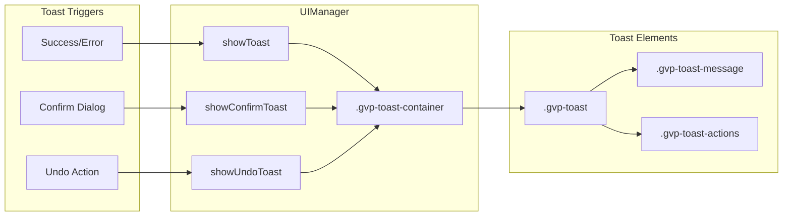

# GVP Toast Notification System

## Summary
UIManager provides a toast notification system for user feedback. Three variants exist: info (auto-dismiss), confirm (Yes/No), and undo (with undo button). All toasts render inside Shadow DOM.

## Architecture Diagram



## File Locations

| Component | File Path |
|-----------|-----------|
| Toast methods | `src/content/managers/UIManager.js` - `showToast()`, `showConfirmToast()`, `showUndoToast()` |
| Container creation | `src/content/managers/UIManager.js` - `_ensureToastContainer()` |
| Toast styles | `src/content/constants/stylesheet.js` - `.gvp-toast-*` classes |

## Toast Types

### 1. Info Toast (`showToast`)
- **Duration**: Default 3000ms
- **Types**: `info`, `success`, `error`, `warning`
- **Auto-dismiss**: Yes
- **Use case**: Status updates, confirmations

### 2. Confirm Toast (`showConfirmToast`)
- **Duration**: Manual dismiss only
- **Buttons**: Yes / No
- **Returns**: Calls `onConfirm` or `onCancel` callback
- **Use case**: Destructive action confirmation

### 3. Undo Toast (`showUndoToast`)
- **Duration**: Default 5000ms
- **Buttons**: Undo
- **Returns**: Calls `onUndo` callback if clicked
- **Use case**: Reversible actions

## Toast Creation Flow

1. `_ensureToastContainer()` creates container if needed
2. Create toast `div` with appropriate class
3. Create message `span` with text
4. Append message to toast
5. Append toast to container
6. Add to `activeToasts` Set for tracking
7. Animate in with `setTimeout(() => toast.classList.add('show'), 10)`
8. Auto-remove after duration (if set)

## Cross-References

- **See KI: gvp-shadow-dom-isolation** - Container location
- **See KI: gvp-21-sub-managers-hierarchy** - Managers that trigger toasts

## Key Methods

| Method | Description |
|--------|-------------|
| `showToast(message, type, duration)` | Show info/success/error toast |
| `showConfirmToast(message, onConfirm, onCancel)` | Show confirmation dialog |
| `showUndoToast(message, onUndo, duration)` | Show undo toast |
| `_removeToast(toast)` | Animate out and remove |

## Style Classes

| Class | Purpose |
|-------|---------|
| `.gvp-toast-container` | Fixed position container in shadowRoot |
| `.gvp-toast` | Base toast styling |
| `.gvp-toast-info` | Info variant |
| `.gvp-toast-success` | Success variant (green) |
| `.gvp-toast-error` | Error variant (red) |
| `.gvp-toast-confirm` | Confirm dialog styling |
| `.gvp-toast-undo` | Undo toast styling |
| `.gvp-toast.show` | Visible state (opacity animation) |

## Animation

Toasts use CSS transitions:
- **In**: Add `.show` class after 10ms delay
- **Out**: Remove `.show` class, wait 300ms, then remove from DOM

## Usage Examples

```javascript
// Info toast
this.uiManager.showToast('Generation started', 'info', 3000);

// Confirm toast
this.uiManager.showConfirmToast(
    'Delete all items?',
    () => this.deleteAll(),
    () => console.log('Cancelled')
);

// Undo toast
this.uiManager.showUndoToast(
    'Item deleted',
    () => this.restoreItem(),
    5000
);
```
