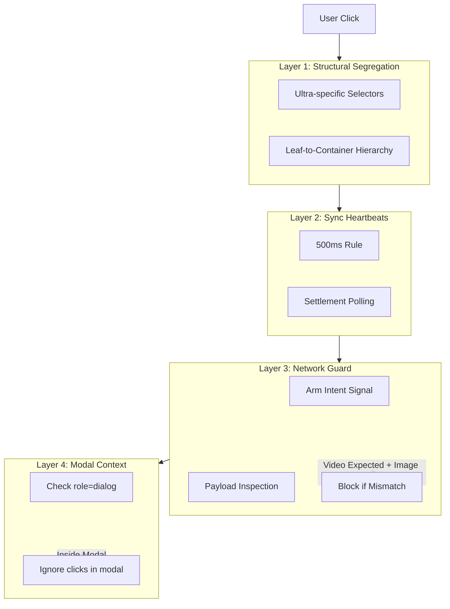

# GVP Triple-Layer Defense

## Summary
To prevent accidental image edits during video generation, GVP implements three defensive layers: structural segregation (selectors), synchronization heartbeats (delays), and network intent guard (payload inspection).

## Architecture Diagram



## File Locations

| Component | File Path |
|-----------|-----------|
| Selectors | `src/content/constants/selectors.js` |
| 500ms Rule | `src/content/managers/ReactAutomation.js` |
| Network Guard | `public/injected/gvpFetchInterceptor.js` |
| Modal Guard | `src/content/content.js` - QuickLaunch handler |

## Layer 1: Structural Segregation

Uses ultra-specific selectors to distinguish "Make Video" from "Edit Image":

- **Leaf-to-container**: Find innermost element (span/svg), then traverse up
- **ARIA labels**: `button[aria-label="Make video"]` vs `button[aria-label="Edit"]`
- **SVG paths**: Specific path signatures for video vs edit buttons
- **Multiple strategies**: Fallback arrays for different Grok UI versions

## Layer 2: Synchronization Heartbeats

The **500ms Rule**: After every UI interaction, wait 500ms for React state to settle:

1. Click Settings → Wait 500ms
2. Wait for Radix menu → Wait 500ms
3. Click "Make Video" → Wait 500ms
4. Inject prompt → Wait 500ms
5. Submit

This prevents race conditions with Grok's async UI updates.

## Layer 3: Network Intent Guard

### Intent Signal (ReactAutomation)
Before submitting, send intent to page context:
```javascript
window.postMessage({
    source: 'gvp-extension',
    type: 'GVP_SET_EXPECTATION',
    payload: { expect: 'video' }
}, '*');
```

### Gatekeeper (gvpFetchInterceptor)
Intercepts `/rest/app-chat/conversations/new` requests:

| Expectation | Payload Signal | Action |
|-------------|----------------|--------|
| `video` | `modelName === "imagine-image-edit"` | BLOCK |
| `video` | `toolOverrides.imageGen === true` | BLOCK |
| `video` | `enableImageGeneration === true` | BLOCK |
| `video` | Valid video payload | ALLOW |

### Auto-Reset
10-second timeout resets expectation to prevent permanent blocking.

## Layer 4: Modal Context Guard

Prevents QuickLaunch from firing inside Image Edit modal:

```javascript
const isInsideModal = e.composedPath().some(el => 
    el instanceof HTMLElement && el.getAttribute('role') === 'dialog'
);
if (isInsideModal) return;
```

This prevents carousel thumbnails from being misidentified as gallery cards.

## Cross-References

- **See KI: gvp-tiptap-prosemirror-injection** - Where 500ms delays are applied
- **See KI: gvp-dual-layer-fetch-interception** - How Network Guard is implemented
- **See KI: gvp-video-queue-pipeline** - Where defense is most critical

## Key Methods

| Method | Location | Description |
|--------|----------|-------------|
| `sendToGenerator()` | ReactAutomation | Primary path with DOM checks |
| `_armNetworkGuard()` | ReactAutomation | Send expectation signal |
| `fetchWrapper()` | gvpFetchInterceptor | Payload inspection |
| `_resolveFavoriteTarget()` | content.js | Modal context check |

## Blocked Request Behavior

When blocked:
1. Throw `Error: 🛑 GVP NETWORK GUARD: BLOCKED ACCIDENTAL IMAGE EDIT`
2. Reset expectation flag
3. Log error for debugging
4. Show toast to user (if in UI context)

## Defense-in-Depth Gap

The primary path (direct button click) lacks Network Guard signal. It relies only on DOM-level checks. Universal arming for both paths is recommended for complete protection.
