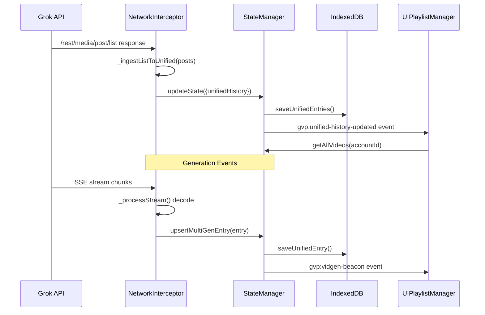

# GVP Unified Video History Flow

## Summary
All video generation data flows from Grok API through NetworkInterceptor into StateManager's unifiedHistory, then persists to IndexedDB. The `unifiedVideoHistory` store is the single source of truth for all generation history.

## Architecture Diagram

## File Locations

| Component | File Path |
|-----------|-----------|
| API ingestion | `src/content/managers/NetworkInterceptor.js` - `_ingestListToUnified()` |
| State management | `src/content/managers/StateManager.js` - `unifiedHistory` array |
| IDB persistence | `src/content/managers/IndexedDBManager.js` - `saveUnifiedEntries()` |
| UI consumption | `src/content/managers/ui/UIPlaylistManager.js` |

## Data Sources

### 1. Gallery Sync (`/rest/media/post/list`)
- Triggered by `triggerBulkGallerySync(accountId)`
- Normalized via `_normalizeGalleryPost(post)`
- Ingested via `_ingestListToUnified(posts, accountId)`

### 2. Generation Events (SSE Streams)
- Captured by `NetworkInterceptor._processStream()`
- Decoded from NDJSON chunks
- Dispatched as `gvp:vidgen-beacon` events
- Captured by StateManager for history updates

### 3. Upload Completions
- After successful upload via `UploadAutomationManager`
- Creates entry with `fileId` as `imageId`
- Links to Video Queue

## Entry Schema

Each entry in `unifiedVideoHistory` contains:

| Field | Type | Description |
|-------|------|-------------|
| `imageId` | string | Primary key (UUID) |
| `accountId` | string | Owner account |
| `thumbnailUrl` | string | Preview image URL |
| `prompt` | string | Generation prompt |
| `customName` | string | User-defined name |
| `videos` | array | Generated video objects |
| `editedImages` | array | Image edit variants |
| `rootImageId` | string | Parent image UUID |
| `parentId` | string | Direct parent UUID |

## Cross-References

- **See KI: gvp-indexeddb-schema-v19** - unifiedVideoHistory store definition
- **See KI: gvp-account-isolation-architecture** - Account scoping in queries
- **See KI: gvp-sse-ndjson-stream-decoding** - How generation events are captured
- **See KI: gvp-terminal-state-persistence** - When writes occur

## Key Methods

| Method | Location | Description |
|--------|----------|-------------|
| `upsertMultiGenEntry(entry)` | IndexedDBManager | Save/update single entry |
| `getAllUnifiedEntries(accountId, limit)` | IndexedDBManager | Retrieve account's history |
| `getAllVideos(accountId)` | StateManager | Flatten entries for video-centric view |

## Video-Centric View

The `getAllVideos(accountId)` method flattens all entries so each video attempt becomes its own item. This allows sorting by individual generation timestamp rather than image creation date.

## Source Mapping

API source values map to internal constants:
- `"favorites"` / `"liked"` / `"saved"` → `MEDIA_POST_SOURCE_LIKED`
- `"all"` / `"gallery"` → `MEDIA_POST_SOURCE_LIKED`

All gallery sources map to LIKED because "Saved" (`/imagine/saved`) is the comprehensive repository.
