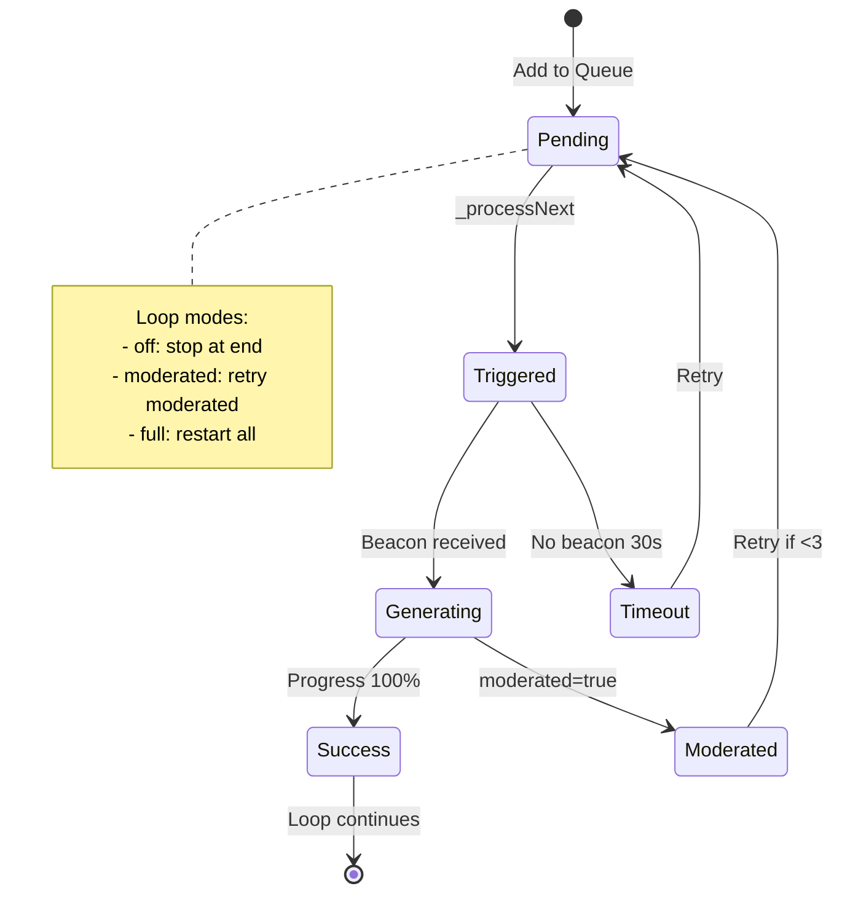

# GVP Video Queue Pipeline

## Summary
VideoQueueManager is the batch video generation engine. It uses a fire-and-forget pattern where items are triggered immediately without waiting for completion, with progress tracked via beacon events.

## Architecture Diagram



## File Locations

| Component | File Path |
|-----------|-----------|
| Queue logic | `src/content/managers/VideoQueueManager.js` |
| UI grid | `src/content/managers/ui/UIVideoQueueManager.js` |
| Concurrency | `src/content/managers/MultiVideoManager.js` |

## Loop Modes

| Mode | Behavior |
|------|----------|
| `off` | Process all pending items once, then stop |
| `moderated` | Reset moderated items to pending, retry up to 3 times |
| `full` | Reset ALL items to pending after completion |

## Fire-and-Forget Pattern

The queue doesn't wait for generation completion:

1. **Pick next** pending item
2. **Navigate** to post page via SPA (`pushState`)
3. **Inject prompt** via `ReactAutomation.sendToGenerator()`
4. **Mark triggered** and immediately schedule next item
5. **Track via beacon** - Listen for `gvp:vidgen-beacon` events

This allows multiple generations in parallel (up to `maxConcurrent` limit).

## Status Transitions

```
pending → triggered → generating → success
                    ↓
                  moderated
                    ↓
              pending (retry)
```

## Cross-References

- **See KI: gvp-tiptap-prosemirror-injection** - How prompts are injected
- **See KI: gvp-terminal-state-persistence** - When items are persisted
- **See KI: gvp-triple-layer-defense** - Safety mechanisms during queue

## Key Methods

| Method | Description |
|--------|-------------|
| `_processNext()` | Pick and trigger next pending item |
| `_handleRailProgress(event)` | Update status from beacon |
| `_handleQueueComplete()` | Handle loop mode, clear success items |
| `addToQueue(imageId, thumbnailUrl, prompt)` | Add item to queue |

## Moderation Handling

- **Streak tracking**: `moderationStreak` counter
- **Auto-pause**: If streak hits `maxModerationStreak` (3), queue pauses
- **Per-item retry**: Each item tracks `moderatedRetries`, max 3
- **Smart clear**: In `moderated` mode, successful items are auto-cleared

## 30-Second Timeout

StateManager tracks pending generations:
- On trigger start: `_startGenerationTimeout(attemptId, imageId)`
- If no beacon within 30s: Mark as timeout, reset to pending
- On beacon received: Clear timeout

## Rate Limit (429) Handling

When 429 detected:
1. NetworkInterceptor → UploadAutomationManager → VideoQueueManager
2. `handleRateLimit(resumeAtMs)` called
3. Queue pauses until `resumeAtMs` timestamp
4. Toast: "Rate limit / Quota exceeded - Pausing automation"

## Queue Item Schema

```javascript
{
    imageId: string,
    thumbnailUrl: string,
    prompt: string,
    status: 'pending' | 'triggered' | 'generating' | 'success' | 'moderated',
    moderatedRetries: number,
    addedAt: timestamp,
    lastAttemptAt: timestamp
}
```
