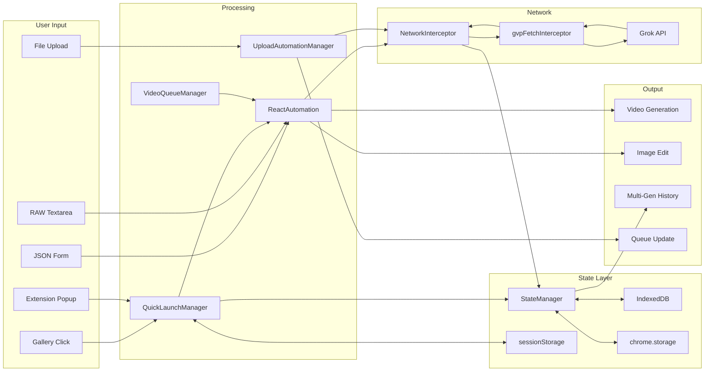
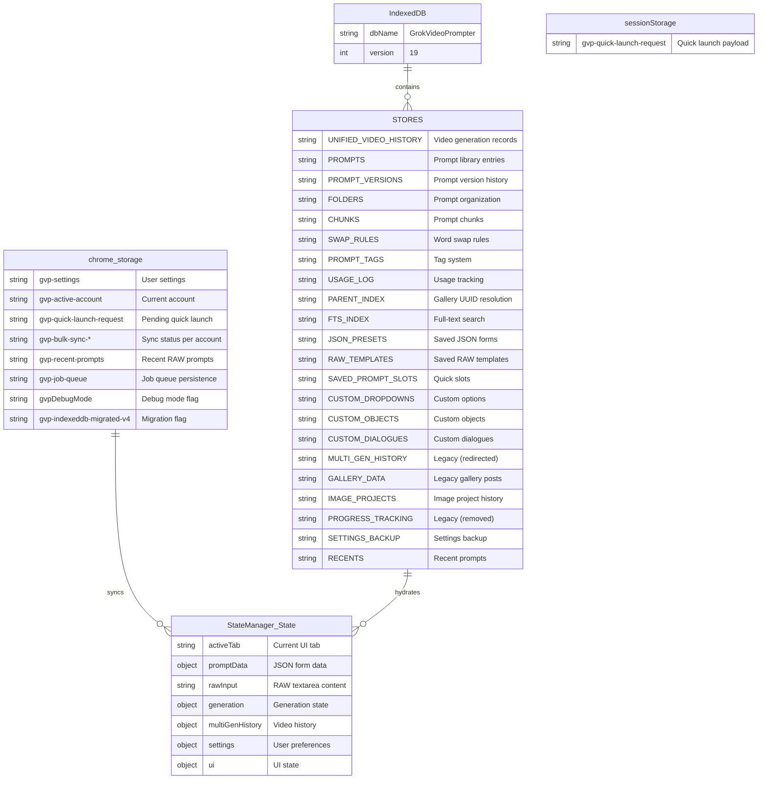

# GVP Extension Architecture Map

## Complete Feature & File Dependency Graph

```mermaid
graph TB
    subgraph CORE["CORE SYSTEM"]
        direction TB
        ENTRY[/"content.js<br/>Main Entry Point"\]
        STATE["StateManager.js<br/>Central State Management"]
        STORAGE["StorageManager.js<br/>Chrome Storage API"]
        IDB["IndexedDBManager.js<br/>Unlimited Storage"]
        LOGGER["Logger.js<br/>Centralized Logging"]
    end

    subgraph BACKGROUND["BACKGROUND & POPUP"]
        BG["background.js<br/>Service Worker"]
        POPUP["popup.js<br/>Extension Popup"]
        OPTIONS["options.js<br/>Options Page"]
    end

    subgraph UI_SYSTEM["UI SYSTEM"]
        direction TB
        UI["UIManager.js<br/>Main UI Controller"]
        
        subgraph UI_MANAGERS["UI Sub-Managers"]
            UI_STATUS["UIStatusManager.js<br/>Status Display"]
            UI_TAB["UITabManager.js<br/>Tab Navigation"]
            UI_MODAL["UIModalManager.js<br/>Modal Dialogs"]
            UI_SETTINGS["UISettingsManager.js<br/>Settings Panel"]
            UI_RAW["UIRawInputManager.js<br/>Raw Input Tab"]
            UI_FORM["UIFormManager.js<br/>JSON Form Tab"]
            UI_UPLOAD["UIUploadManager.js<br/>Upload Queue Tab"]
            UI_PLAYLIST["UIPlaylistManager.js<br/>Playlist Manager"]
            UI_GALLERY["UIGalleryManager.js<br/>Gallery Controls"]
            UI_GALLERY_MINI["GalleryMiniUIManager.js<br/>Mini Gallery UI"]
            UI_INSPECTOR["UIInspectorManager.js<br/>Inspector Panel"]
            UI_VIDEO_QUEUE["UIVideoQueueManager.js<br/>Video Queue Tab"]
            UI_UPSCALE["UIUpscaleAutomationManager.js<br/>Upscale Automation"]
            BATCH_LAUNCH["BatchLauncherManager.js<br/>Batch Launch Controls"]
            UI_PROGRESS["UIProgressAPI.js<br/>Progress Indicators"]
        end
        
        subgraph PHASE2["Phase 2 Tools"]
            UI_PROMPT_LIB["UIPromptLibraryManager.js<br/>Prompt Library"]
            UI_CHUNK["UIChunkBuilderManager.js<br/>Chunk Builder"]
            UI_SWAP["UIWordSwapperManager.js<br/>Word Swapper"]
            UI_SFW["UISFWModeManager.js<br/>SFW Mode"]
            UI_IDB_HARVEST["UIIDBHarvesterManager.js<br/>IDB Harvester"]
        end
    end

    subgraph AUTOMATION["AUTOMATION ENGINE"]
        direction TB
        REACT["ReactAutomation.js<br/>React UI Control"]
        UPLOAD_AUTO["UploadAutomationManager.js<br/>Multi-Upload Queue"]
        VIDEO_QUEUE["VideoQueueManager.js<br/>Batch Video Queue"]
        QUICK["QuickLaunchManager<br/>Quick JSON/RAW/Edit"]
        MULTI_VIDEO["MultiVideoManager.js<br/>Multi-Video Coord"]
        IMAGE_PROJ["ImageProjectManager.js<br/>Image Project Tracking"]
        JOB_QUEUE["JobQueueManager.js<br/>Background Job Queue"]
        QUICK_LAUNCH[/"content.js<br/>QuickLaunchManager"\]
    end

    subgraph NETWORK["NETWORK LAYER"]
        direction TB
        NET["NetworkInterceptor.js<br/>Fetch Interception"]
        FETCH_INJECT["gvpFetchInterceptor.js<br/>Passive Observer"]
        MOD_DETECT["ModerationDetector.js<br/>Moderation Detection"]
    end

    subgraph CONSTANTS["CONSTANTS & CONFIG"]
        direction TB
        SELECTORS["selectors.js<br/>DOM Selectors"]
        REGEX["regex.js<br/>Pattern Matching"]
        STYLES["stylesheet.js<br/>CSS Styles"]
        THEME["theme.js<br/>Theme Variables"]
        SCHEMA["gvp_schema_lookups.js<br/>JSON Schema"]
        PARTS["gvp_parts_lookups.js<br/>Part Definitions"]
        UI_CONST["uiConstants.js<br/>UI Constants"]
    end

    subgraph UTILS["UTILITIES"]
        direction TB
        HELPERS["UIHelpers.js<br/>UI Utilities"]
        DEBOUNCE["debounce.js<br/>Debounce Functions"]
        STR_UTIL["StringUtils.js<br/>String Utilities"]
        SENTENCE["SentenceFormatter.js<br/>Sentence Formatting"]
        ARRAY_MGR["ArrayFieldManager.js<br/>Array Field Handling"]
        STORAGE_HELPER["StorageHelper.js<br/>Storage Utilities"]
        LOOKUP["LookupLoader.js<br/>Lookup Loading"]
    end

    subgraph RECORDER["RECORDER SYSTEM"]
        direction TB
        REC_UI["RecorderUI.js<br/>Recorder Interface"]
        ACTION_SCHEMA["ActionSchema.js<br/>Action Definitions"]
        MISSION["MissionManager.js<br/>Mission Control"]
    end

    subgraph FEATURES["KEY FEATURES"]
        direction LR
        F1["Quick JSON<br/>Auto-prompt from gallery"]
        F2["Quick RAW<br/>Raw text auto-prompt"]
        F3["Quick Edit<br/>Auto image editing"]
        F4["Quick Video<br/>Video from edited images"]
        F5["Upload Mode<br/>Batch file processing"]
        F6["Video Queue<br/>Batch video generation"]
        F7["Spicy Mode<br/>Enhanced generation"]
        F8["Silent Mode<br/>Audio-free videos"]
        F9["Upscale Auto<br/>Auto upscaling"]
        F10["Gallery Controls<br/>In-page actions"]
        F11["Word Swap<br/>Prompt transformations"]
        F12["Chunk Builder<br/>Prompt assembly"]
        F13["Aurora Mode<br/>Auto blank image injection"]
    end

    %% Core Dependencies
    ENTRY --> STATE
    ENTRY --> UI
    ENTRY --> REACT
    ENTRY --> NET
    ENTRY --> QUICK
    ENTRY --> BG
    
    BG --> POPUP
    
    STATE --> STORAGE
    STATE --> IDB
    STATE --> LOGGER
    
    IDB --> STORAGE
    
    %% UI Dependencies
    UI --> STATE
    UI --> REACT
    UI --> UI_MANAGERS
    UI --> PHASE2
    UI --> QUICK
    UI --> NET
    
    UI_MANAGERS --> UI
    UI_MANAGERS --> STATE
    UI_MANAGERS --> SELECTORS
    
    PHASE2 --> UI
    PHASE2 --> STATE
    PHASE2 --> UI_MODAL
    
    %% Automation Dependencies
    REACT --> STATE
    REACT --> SELECTORS
    REACT --> NET
    
    UPLOAD_AUTO --> STATE
    UPLOAD_AUTO --> UI
    UPLOAD_AUTO --> NET
    
    VIDEO_QUEUE --> STATE
    VIDEO_QUEUE --> UI_VIDEO_QUEUE
    VIDEO_QUEUE --> REACT
    
    QUICK --> STATE
    QUICK --> UI
    QUICK --> REACT
    
    MULTI_VIDEO --> STATE
    IMAGE_PROJ --> STATE
    IMAGE_PROJ --> IDB
    JOB_QUEUE --> STATE
    
    %% Network Dependencies
    NET --> STATE
    NET --> REACT
    NET --> UPLOAD_AUTO
    NET --> MOD_DETECT
    NET --> FETCH_INJECT
    
    FETCH_INJECT --> NET
    FETCH_INJECT --> BG
    
    %% Constants Dependencies
    SELECTORS --> LOGGER
    REACT --> SELECTORS
    UI --> SELECTORS
    UPLOAD_AUTO --> SELECTORS
    NET --> SELECTORS
    
    %% Utils Dependencies
    UI --> HELPERS
    UI --> SENTENCE
    UI --> ARRAY_MGR
    REACT --> DEBOUNCE
    STATE --> STR_UTIL
    
    %% Feature Connections
    QUICK --> F1
    QUICK --> F2
    QUICK --> F3
    QUICK --> F4
    UPLOAD_AUTO --> F5
    VIDEO_QUEUE --> F6
    UI --> F7
    UI --> F8
    UI_UPSCALE --> F9
    UI_GALLERY --> F10
    UI_SWAP --> F11
    UI_CHUNK --> F12
    FETCH_INJECT --> F13
    UPLOAD_AUTO --> F14

    %% Style Classes
    classDef core fill:#ff6b6b,stroke:#c92a2a,color:#fff
    classDef ui fill:#4dabf7,stroke:#1971c2,color:#fff
    classDef auto fill:#51cf66,stroke:#2f9e44,color:#fff
    classDef net fill:#ffd43b,stroke:#fab005,color:#000
    classDef const fill:#845ef7,stroke:#5f3dc4,color:#fff
    classDef util fill:#20c997,stroke:#0ca678,color:#fff
    classDef feat fill:#f783ac,stroke:#e64980,color:#fff
    classDef bg fill:#868e96,stroke:#495057,color:#fff
    
    class ENTRY,STATE,STORAGE,IDB,LOGGER core
    class BG,POPUP,OPTIONS bg
    class UI,UI_STATUS,UI_TAB,UI_MODAL,UI_SETTINGS,UI_RAW,UI_FORM,UI_UPLOAD,UI_PLAYLIST,UI_GALLERY,UI_GALLERY_MINI,UI_INSPECTOR,UI_VIDEO_QUEUE,UI_UPSCALE,UI_PROMPT_LIB,UI_CHUNK,UI_SWAP,UI_SFW,UI_IDB_HARVEST,BATCH_LAUNCH,UI_PROGRESS ui
    class REACT,UPLOAD_AUTO,VIDEO_QUEUE,QUICK,MULTI_VIDEO,IMAGE_PROJ,JOB_QUEUE auto
    class NET,FETCH_INJECT,MOD_DETECT net
    class SELECTORS,REGEX,STYLES,THEME,SCHEMA,PARTS,UI_CONST const
    class HELPERS,DEBOUNCE,STR_UTIL,SENTENCE,ARRAY_MGR,STORAGE_HELPER,LOOKUP util
    class F1,F2,F3,F4,F5,F6,F7,F8,F9,F10,F11,F12,F13,F14 feat
```



---

## File Inventory (76 JavaScript Files)

### 📁 src/background/ (1 file)
| File | Purpose |
|------|---------|
| `background.js` | Service worker - handles extension icon clicks, keyboard shortcuts, omnibox search |

### 📁 src/popup/ (1 file)
| File | Purpose |
|------|---------|
| `popup.js` | Extension popup UI - opens main GVP drawer |

### 📁 src/options/ (1 file)
| File | Purpose |
|------|---------|
| `options.js` | Extension options page |

### 📁 src/utils/ (1 file)
| File | Purpose |
|------|---------|
| `storage.js` | Storage utilities |

### 📁 public/injected/ (1 file)
| File | Purpose |
|------|---------|
| `gvpFetchInterceptor.js` | Passive Observer - monitors SSE stream for media URLs |

### 📁 src/content/ (1 file)
| File | Purpose |
|------|---------|
| `content.js` | Main entry point - QuickLaunchManager, initialization |

### 📁 src/content/managers/ (14 files)
| File | Purpose |
|------|---------|
| `StateManager.js` | Central state management, multi-gen history, settings |
| `StorageManager.js` | Chrome storage API wrapper |
| `IndexedDBManager.js` | IndexedDB for unlimited storage (19 stores) |
| `UIManager.js` | Main UI controller, shadow DOM management |
| `ReactAutomation.js` | React UI automation, video generation, image editing |
| `NetworkInterceptor.js` | Fetch interception, request modification |
| `UploadAutomationManager.js` | Multi-file upload queue, Guillotine mode |
| `VideoQueueManager.js` | Batch video generation queue |
| `MultiVideoManager.js` | Concurrent video generation management |
| `ImageProjectManager.js` | Image-centric project history |
| `GrokSettingsManager.js` | Grok API settings management |
| `JobQueueManager.js` | Background job queue (upscale, unlike, relike) |
| `RawInputManager.js` | Basic raw input handling |
| `AdvancedRawInputManager.js` | Templates, spicy mode, batch processing |
| `InspectionManager.js` | Image inspection functionality |
| `UIProgressAPI.js` | Progress indicator API |

### 📁 src/content/managers/ui/ (21 files)
| File | Purpose |
|------|---------|
| `UIStatusManager.js` | Status bar and indicators |
| `UITabManager.js` | Tab navigation |
| `UIModalManager.js` | Modal dialogs |
| `UISettingsManager.js` | Settings panel |
| `UIRawInputManager.js` | Raw input tab |
| `UIFormManager.js` | JSON form tab |
| `UIUploadManager.js` | Upload queue tab |
| `UIPlaylistManager.js` | Playlist manager |
| `UIGalleryManager.js` | Gallery controls overlay |
| `GalleryMiniUIManager.js` | Mini gallery UI |
| `UIInspectorManager.js` | Inspector panel |
| `UIVideoQueueManager.js` | Video queue tab |
| `UIUpscaleAutomationManager.js` | Upscale automation |
| `UIPromptLibraryManager.js` | Prompt library modal |
| `UIChunkBuilderManager.js` | Chunk/prompt builder |
| `UIWordSwapperManager.js` | Word swap rules |
| `UISFWModeManager.js` | SFW mode transformations |
| `UIIDBHarvesterManager.js` | IDB data harvesting |
| `UIHelpers.js` | UI utility functions |
| `uiConstants.js` | UI constants |
| `BatchLauncherManager.js` | Batch launch controls |

### 📁 src/content/utils/ (8 files)
| File | Purpose |
|------|---------|
| `Logger.js` | Centralized logging with debug toggle |
| `StringUtils.js` | String utilities |
| `SentenceFormatter.js` | Sentence formatting |
| `ArrayFieldManager.js` | Array field handling |
| `debounce.js` | Debounce functions |
| `StorageHelper.js` | Storage utilities |
| `LookupLoader.js` | Lookup table loading |
| `ModerationDetector.js` | Moderation detection |

### 📁 src/content/constants/ (6 files)
| File | Purpose |
|------|---------|
| `selectors.js` | DOM selectors (function-based architecture) |
| `regex.js` | Regular expression patterns |
| `stylesheet.js` | CSS styles for shadow DOM |
| `theme.js` | Theme variables |
| `gvp_schema_lookups.js` | JSON schema definitions |
| `gvp_parts_lookups.js` | Prompt part definitions |

### 📁 src/content/recorder/ (3 files)
| File | Purpose |
|------|---------|
| `RecorderUI.js` | Recording interface |
| `ActionSchema.js` | Action definitions |
| `MissionManager.js` | Mission control |

---

## Feature-to-File Mapping

### 🎯 Quick Launch System
| Feature | Primary File | Dependencies |
|---------|-------------|--------------|
| Quick JSON | `content.js` → QuickLaunchManager | StateManager, UIManager, ReactAutomation |
| Quick RAW | `content.js` → QuickLaunchManager | StateManager, UIManager, ReactAutomation |
| Quick Edit | `content.js` → QuickLaunchManager | ReactAutomation.monitorAndEdit() |
| Quick Video from Edit | `content.js` → QuickLaunchManager | ReactAutomation, StateManager |

### 📤 Upload Automation
| Feature | Primary File | Dependencies |
|---------|-------------|--------------|
| Multi-File Queue | `UploadAutomationManager.js` | StateManager, UIManager |
| Clipboard Paste | `UploadAutomationManager.js` | NetworkInterceptor |
| Moderation Recovery | `UploadAutomationManager.js` | ModerationDetector |
| Guillotine Mode | `UploadAutomationManager.js` | NetworkInterceptor, StateManager |
| Aurora Mode | `gvpFetchInterceptor.js` | NetworkInterceptor |

### 🎬 Video Queue System
| Feature | Primary File | Dependencies |
|---------|-------------|--------------|
| Batch Processing | `VideoQueueManager.js` | UIVideoQueueManager, ReactAutomation |
| Loop Modes | `VideoQueueManager.js` | StateManager |
| Prompt Packs | `VideoQueueManager.js` | UIPromptLibraryManager |
| Smart Edit Scheduling | `VideoQueueManager.js` | StateManager |

### ⚛️ React Automation
| Feature | Primary File | Dependencies |
|---------|-------------|--------------|
| Video Generation | `ReactAutomation.sendToGenerator()` | selectors.js |
| Image Editing | `ReactAutomation.monitorAndEdit()` | selectors.js |
| Mode Transitions | `ReactAutomation.forceVideoModeTransition()` | selectors.js |
| SPA Navigation | `ReactAutomation._navigateToPost()` | - |
| Aggressive Click | `ReactAutomation.aggressiveClick()` | - |

### 🎨 UI System
| Feature | Primary File | Dependencies |
|---------|-------------|--------------|
| Main Drawer | `UIManager.js` | All sub-managers |
| JSON Form | `UIFormManager.js` | StateManager, ArrayFieldManager |
| RAW Input | `UIRawInputManager.js` | AdvancedRawInputManager |
| Upload Queue | `UIUploadManager.js` | UploadAutomationManager |
| Video Queue | `UIVideoQueueManager.js` | VideoQueueManager |
| Gallery Controls | `UIGalleryManager.js` | NetworkInterceptor |
| Settings | `UISettingsManager.js` | StateManager, GrokSettingsManager |
| Prompt Library | `UIPromptLibraryManager.js` | IndexedDBManager |
| Chunk Builder | `UIChunkBuilderManager.js` | IndexedDBManager |
| Word Swapper | `UIWordSwapperManager.js` | IndexedDBManager |

### 🌐 Network Layer
| Feature | Primary File | Dependencies |
|---------|-------------|--------------|
| Fetch Interception | `NetworkInterceptor.js` | StateManager, ReactAutomation |
| Request Modification | `gvpFetchInterceptor.js` | page context script |
| Response Parsing | `NetworkInterceptor.js` | ModerationDetector |
| Progress Tracking | `NetworkInterceptor.js` | StateManager.multiGenHistory |
| Payload Override | `gvpFetchInterceptor.js` | postMessage bridge |
| Aurora Injection | `gvpFetchInterceptor.js` | Grok upload API |
| Network Guard | `gvpFetchInterceptor.js` | Image edit protection |

---

## Data Flow Architecture



---

## Storage Architecture



---

## Key Integration Points

### 1. Extension → Page Context Bridge
```
┌─────────────────┐     postMessage      ┌────────────────────┐
│   Content.js    │ ──────────────────► │ gvpFetchInterceptor │
│ (Isolated World)│                      │   (Page Context)   │
│                 │ ◄────────────────── │                    │
└─────────────────┘   CustomEvent/gvp:*  └────────────────────┘
```

**Message Types:**
- `GVP_SET_PAYLOAD_OVERRIDE` - Inject prompt into request
- `GVP_STATE_UPDATE` - Sync spicy mode
- `GVP_PROMPT_STATE` - Bridge prompt text
- `GVP_SET_EXPECTATION` - Network guard
- `GVP_AURORA_STATE` - Aurora configuration
- `GVP_FETCH_PROGRESS` - Progress updates
- `GVP_FETCH_VIDEO_PROMPT` - Completed video

### 2. State Synchronization
```
┌──────────────┐     chrome.storage     ┌──────────────┐
│ StateManager │ ◄───────────────────► │  Background  │
│              │     onMessage         │   Worker     │
└──────────────┘                       └──────────────┘
       │
       │ IndexedDB
       ▼
┌──────────────┐
│  IDBManager  │
│ 19 stores    │
└──────────────┘
```

### 3. UI Event System
```
┌──────────────┐                       ┌──────────────┐
│   UIManager  │ ──── gvp:ui:* ──────► │  Managers    │
│  (Shadow DOM)│                       │              │
└──────────────┘                       └──────────────┘
       │
       │ CustomEvent
       ▼
┌──────────────────────────────────────────────────┐
│ Events:                                          │
│ • gvp:quick-launch-mode-changed                  │
│ • gvp:upload-mode-changed                        │
│ • gvp:gallery-data-updated                       │
│ • gvp:queue-status                               │
│ • gvp:path-changed                               │
│ • gvp:new-request                                │
│ • gvp:vidgen-beacon                              │
└──────────────────────────────────────────────────┘
```

---

## Summary Statistics

| Category | Count |
|----------|-------|
| **Total JavaScript Files** | **76** |
| Core Managers | 15 |
| UI Managers | 21 |
| Utilities | 8 |
| Constants | 7 |
| Background/Popup/Options | 3 |
| Injected Scripts | 1 |
| **Key Features** | **14** |
| **IndexedDB Stores** | **19** |
| **chrome.storage Keys** | **10+** |

---

## Version History Highlights

| Version | Key Changes |
|---------|-------------|
| v1.47.x | Network Guard, Payload Override TTL |
| v1.38.x | Navigation gate, debug QuickLaunch |
| v1.36.x | Blind execution, Nuclear option |
| v1.31.x | Payload override system |
| v1.30.x | Network Guard protection |
| v1.21.x | Rail navigation guard, cooldown system |
| v1.19.x | Omnibox search indexes |
| v1.17.x | Parent index for UUID resolution |
| v1.13.x | Prompt Library with FTS |
| v1.7.x | Unified Video History store |
| v1.4.x | Custom dropdowns, objects, dialogues |
