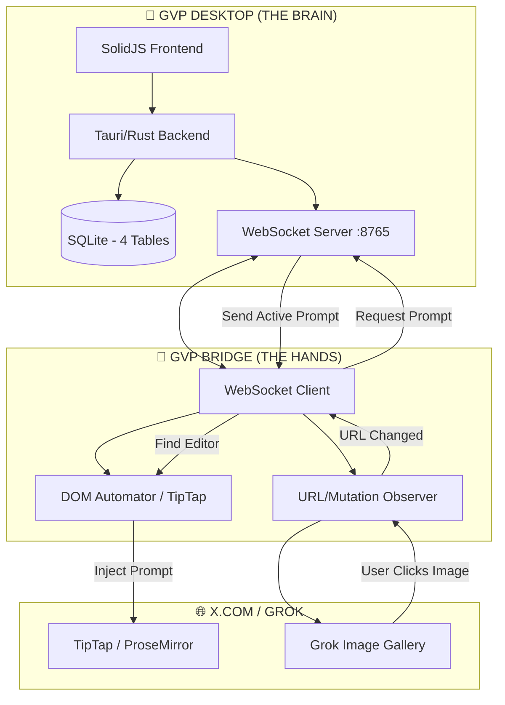

# 🚀 GVP MISSION CONTROL

## 1. THE VISION
**Objective**: Translate the "Grok Imagine Video Prompter" (GVP) from a legacy Chrome Extension into a high-performance **Tauri/SolidJS Desktop Application** with a "Dumb Bridge" extension for DOM interaction.

**The Goal**: Enable the user to control Grok video generation with zero friction. The Desktop app acts as the "Brain," and the Extension acts as the "Hands."

---

## 2. ECOSYSTEM ARCHITECTURE
The system operates as a distributed automation engine.

---

## 3. CORE WORKFLOW: THE PROTOCOL
We use a strict **Master/Slave LLM Pipeline** to ensure zero-autonomy execution and high-logic design.

### Role: Strategic Co-Pilot (YOU)
You manage the user's interaction with the sub-agents. You **NEVER** write application code directly.
1. **Orchestrate**: Use your research tools to understand the state.
2. **Design**: Draft aggressive prompts for the **Master Architect**.
3. **Guard**: Review the Architect's plans for "traps" (hallucinations, missing proxy refs).
4. **Deploy**: Hand the exact `/flash-implement` command to the user.

### Role: Master Architect (Claude Online)
- **Tool**: [GitHub Repo](https://github.com/hoangquangtung7019996-boop/GVP-Bridge-Desktop)
- **Function**: Receives context, designs architecture, and writes `Find/Replace` plans.
- **Rule**: Must be binary-precise. No `// ... rest of code` placeholders.

### Role: Implementer (Gemini Flash Local)
- **Tool**: IDE Agent.
- **Function**: Zero-autonomy executor. Applies plans exactly.
- **Rule**: If a plan is ambiguous, it must FAIL and report back.

---

## 4. CURRENT PROJECT STATE
- ✅ **Data Migration & Proxy**: 100% complete. Rust proxy successfully streams protected media using `reqwest::blocking` and smuggled cookies.
- ✅ **Detail Workspace**: 100% functional. Prompt routing (Copy/Send) is active.
- 🔴 **CRITICAL BLOCKER**: **Main Gallery Grid Collapse**. Chromium bug squashing cards into thin vertical slivers when `GalleryState === "root"`.

